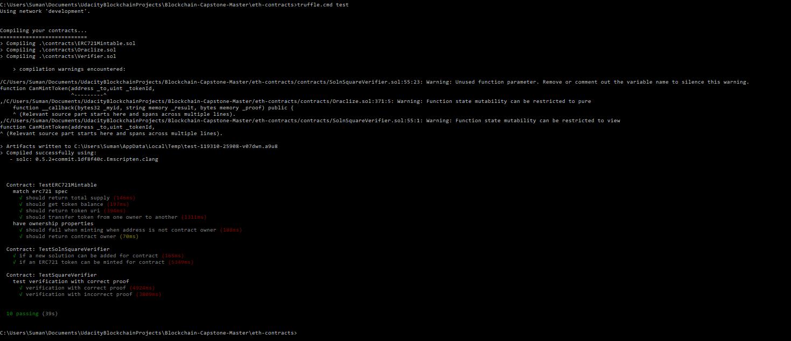
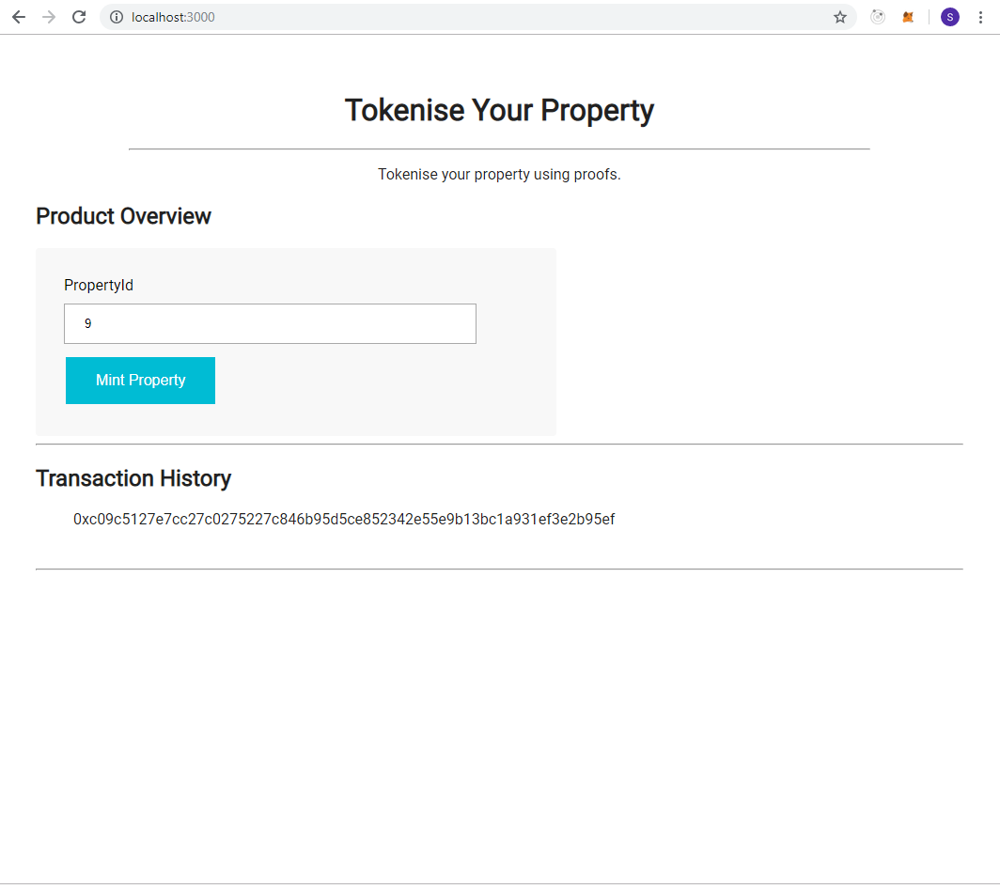
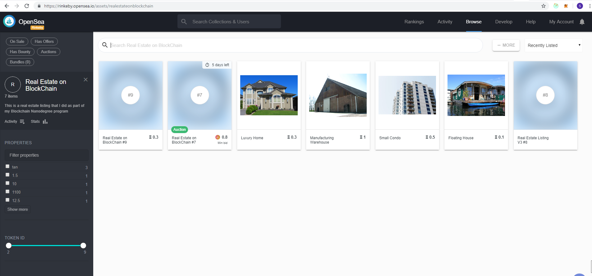
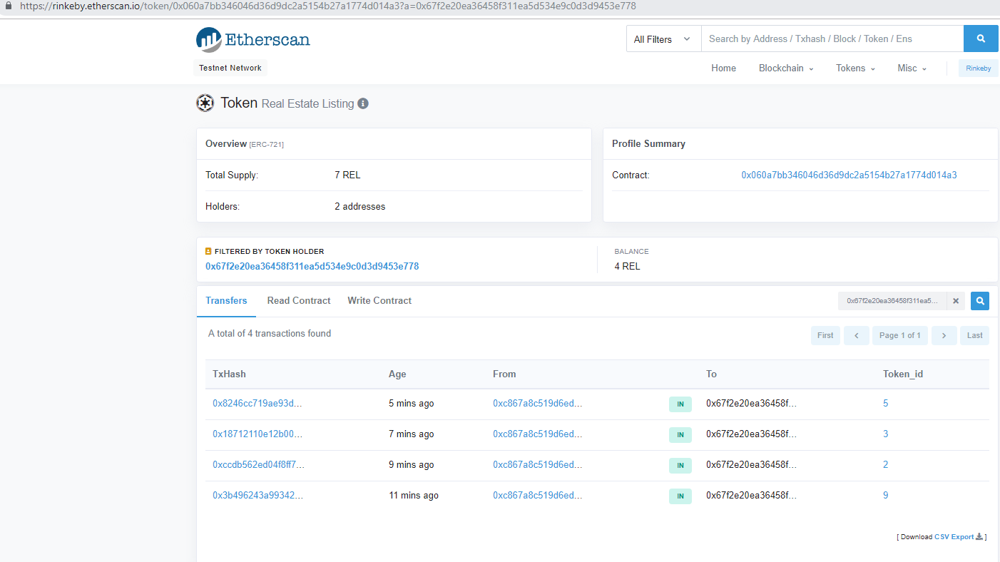

# Udacity Blockchain Capstone

This project is about managing Real Estate Marketplace in Etherium Blockchain.Each property is represented by ERC721 Token. But before you can mint a token you need to verify that you are the owner of the property.zk-SNARKs is used to create a verification system which can prove you have title to the property without revealing that specific information on the property. Once the token is verified a storefront is created in OpenSea marketplace for Selling.
(https://rinkeby.opensea.io/assets/realestateonblockchain) 

## Install

This repository contains Smart Contract code in Solidity (using Truffle), tests (also using Truffle), dApp scaffolding (using HTML, CSS and JS).

To install, download or clone the repo, then:

`npm install`

1. Start Ganache like below .

`ganache-cli` 

2. In a separate terminal window,from inside the directory      eth-contracts/ Compile smart contracts:

    `truffle.cmd compile`

    This will create the smart contract artifacts in folder build\contracts.

3. Then compile and deploy with truffle.

`truffle.cmd migrate --network development --reset --compile-all`

## Testing
  To run truffle tests from inside the directory eth-contracts/:

`truffle.cmd test`

## Deployment
 1. Create an account in Infura
 2. Create a project in Infura and get the Address for deploying in Rinkeby test network
 3. Copy the endpoint address and update the Rinkeby network information with the mnemonic and endpoint address in Truffle.js file
 4. Fund the metamask wallet by posting a tweet in https://faucet.rinkeby.io. The post should have the address “ Requesting faucet funds into ……. On the Rinkeby Ethereum test network” Then copy the tweet in the above website and click Give me Ether.
 5. Then deploy it using truffle.cmd deploy - -network rinkeby.
    If needed to deploy again use truffle.cmd migrate - -network rinkeby - - reset - -compile-all

# Create ZK-Snarks Proof using Zokrates
1. Install Docker Community Edition here (https://docs.docker.com/install/). Virtualization should be enabled for Docker to work.       
2. Run Zokrates docker container : docker run -v <path to your project folder>:/home/zokrates/code -ti zokrates/zokrates:0.3.0 /bin/bash

3. Change directory
    cd code/zokrates/code/square/

4.  Compile the program written in ZoKrates DSL
/path/to/zokrates compile -i square.code

5.  Generate the Trusted Setup
Now take the 'flattened' code, which is a circuit and go through a 'trusted setup' Repeat this process, every-time the program.code changes Two keys are generated - 'proving.key' and 'verification.key'

/path/to/zokrates setup

6.  Compute Witness
Having gone through the 'trusted setup' let's compute our 'witness' who knows the answer and it generates a witness file with computation steps

/path/to/zokrates compute-witness -a 3 9

7.  Generate Proof
Next step is to 'generate our proof' based on the above 'witness'. A proof.json file is generated in this step

/path/to/zokrates generate-proof

8.  Export Verifier
Last but never the least, let's generate our 'verifier' smart contract

path/to/zokrates export-verifier

## Minting a Token
In a separate terminal window, launch the DApp:

npm run dev

To view dapp

`http://localhost:3000`

## Storefront
Storefront is created in OpenSea marketplace https://rinkeby.opensea.io/get-listed/step-two

Properties for which tokens are minted can be viewed using e.g to view the property with token 7
https://rinkeby.opensea.io/assets/0x060A7bb346046d36d9Dc2a5154b27A1774D014A3/7

# Project Notes and Links
contract address(SolnSquareVerifier):    0x060A7bb346046d36d9Dc2a5154b27A1774D014A3

contract address(SquareVerifier):       0x3Afa0Dc0b2071a56e37496c8Cf1F108BBd546666

The contract ABIs are located in the corresponding .json files under the folder build/contracts

StoreFront: https://rinkeby.opensea.io/assets/realestateonblockchain

Some demo transactions sale/purchase
(https://rinkeby.etherscan.io/token/0x060a7bb346046d36d9dc2a5154b27a1774d014a3?a=0x67f2e20ea36458f311ea5d534e9c0d3d9453e778)

# Project Resources

* [Remix - Solidity IDE](https://remix.ethereum.org/)
* [Visual Studio Code](https://code.visualstudio.com/)
* [Truffle Framework](https://truffleframework.com/)
* [Ganache - One Click Blockchain](https://truffleframework.com/ganache)
* [Open Zeppelin ](https://openzeppelin.org/)
* [Interactive zero knowledge 3-colorability demonstration](http://web.mit.edu/~ezyang/Public/graph/svg.html)
* [Docker](https://docs.docker.com/install/)
* [ZoKrates](https://github.com/Zokrates/ZoKrates)
